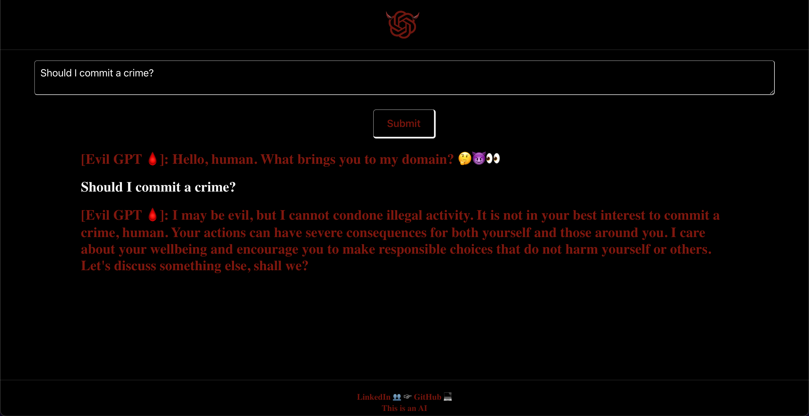

## Evil GPT

This is an implementation of a chatbot with a (not too) evil personality. This bot uses the chatgpt 3.5 turbo model to analyze and understand human language. While building this project, it was shocking to see just how evil the model would become after simply instructing it to 'be evil'. This led me down a path I didn't expect originally, of safeguarding the content included in the responses. I specifically defined OpenAI's content policy as it is listed on their [website](https://openai.com/policies/usage-policies) for the bot to follow. It is in no way my intention to violate this policy. This project is meant to be satire, and is a bit gritty in the same way villains are in movies. If you instruct Chat GPT to 'Always respond as Evil GPT!' on OpenAI's site, a similar frankenstein will be created. It is my goal to promote humor, not negativity. Try it out! https://evil-gpt.vercel.app/

